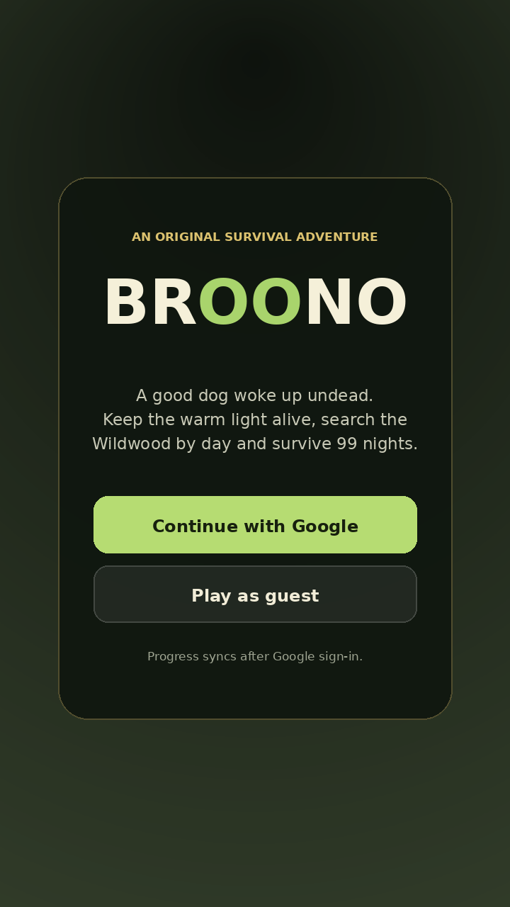
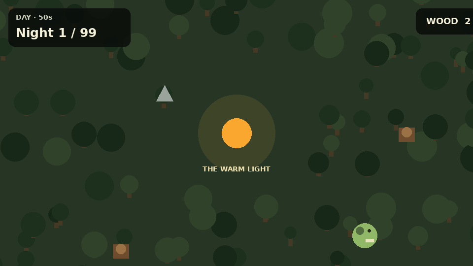
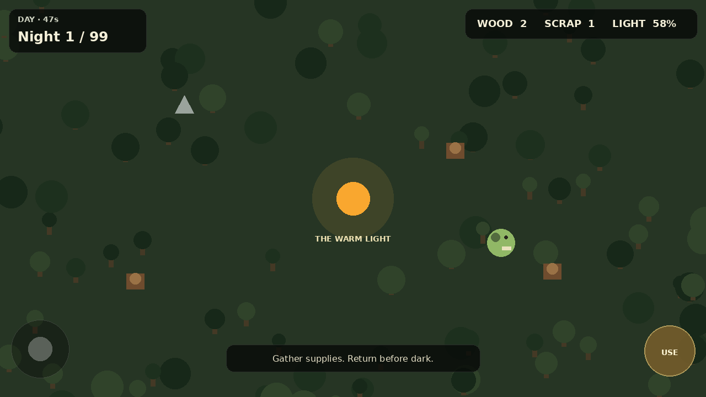
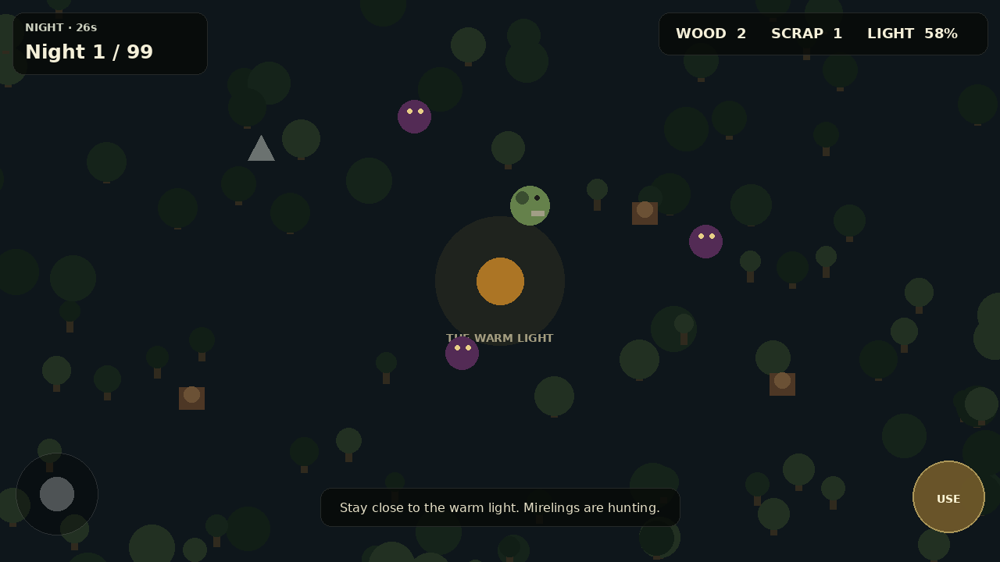

# Broono demo review

> **PR:** [#54 — Reset Broono as zombie-dog survival game](https://github.com/wilfgrainger/broono/pull/54)  
> **Status:** First playable vertical slice · guest mode works · draft, not release-ready

**A good dog woke up undead. Survive the Wildwood for 99 nights.**

Broono is an original, mobile-first survival game. Explore during daylight, gather supplies, keep the warm light fuelled and stay alive when the mirelings emerge after dark.

## Current prototype

<p align="center">
  
</p>

The prototype starts in guest mode without credentials. Google sign-in and cloud saves become available when the Cloudflare D1 and OAuth configuration is supplied.

### Short gameplay walkthrough



[Download the MP4 walkthrough](demo/gameplay-playtest.mp4)

The media in this document is a deterministic, code-accurate render preview of the current procedural scene, colours, entities, HUD values and day/night mechanics. It is not being presented as live device footage. Browser/device capture should replace it once the preview deployment is configured.

### Day and night states

| Day: explore and gather | Night: protect the light |
| --- | --- |
|  |  |

## Three-minute reviewer script

1. Start the development server with `npm ci && npm run dev`.
2. Open the shown local URL and choose **Play as guest**.
3. Move Broono with **WASD / arrow keys**, or drag the virtual stick on a phone-sized viewport.
4. Walk over wood and scrap to collect them. Confirm the HUD totals change.
5. Return to **The Warm Light** with at least two wood and press **E / Use**. Confirm two wood are consumed and light fuel increases.
6. Let the 50-second daylight phase finish. Confirm the scene enters night, the objective changes and mirelings begin spawning.
7. Move away from the light. Confirm exposure drains health and contact with a mireling applies damage.
8. Survive the 35-second night. Confirm daylight returns and the night counter advances.

## What this slice proves

| Capability | Review evidence |
| --- | --- |
| Browser game renderer | Phaser scene runs from the shared TypeScript client |
| Mobile input | Touch joystick and large action button |
| Desktop input | WASD, arrow keys and E |
| Core loop | Explore → gather → refuel → survive → advance |
| Progression | Day/night cycle and bounded night counter through night 99 |
| Threat pressure | Escalating mireling speed/spawn rate, exposure and collision damage |
| Offline entry | Guest play does not depend on the network |
| Account boundary | Google credential flow terminates at the Cloudflare Worker |
| Persistence foundation | D1 schema and authenticated save/leaderboard endpoints |
| Mobile packaging | Capacitor configuration for the shared web build |

## Validation recorded for this PR

```text
npm test
  2 tests passed

npm run build
  TypeScript, Worker type-check and Vite production build passed

npx wrangler deploy --dry-run
  Worker bundle and D1 binding validation passed
```

The two automated tests cover phase progression, the 99-night cap and light-refuelling rules. The reviewer script above remains a manual acceptance test until browser end-to-end capture is restored.

## Honest current limits

- The scene uses generated geometric prototype art; original production character animation, environments, audio and effects are not built.
- Combat, crafting, rescues, seeded maps, game-over/restart, revive and cooperative parties are next-release work.
- Health and hunger exist in simulation state but need player-facing HUD bars and clearer feedback.
- Google sign-in cannot complete until the OAuth client ID and Worker secrets are configured.
- Cloud saves and leaderboards require the real D1 database ID and initial migration.
- The Cloudflare preview deployment for this PR is currently failing, so there is no trustworthy public play URL or live browser/device recording yet.
- Client-reported leaderboard progress is provisional until server-authoritative run validation exists.

## Review questions

- Does the first minute make the gather/refuel/survive loop obvious without explanation?
- Does Broono already feel like the hero, despite placeholder art?
- Is the 50-second day / 35-second night pacing suitable for the first mobile test?
- Should the next slice prioritise combat and crafting, or the first lost-animal rescue?
- Is the touch layout comfortable in portrait as well as landscape?

## Next demo milestone

1. Restore a successful Cloudflare preview deployment.
2. Add health/hunger HUD, game-over/restart and one complete crafting interaction.
3. Add original Broono idle/run/bite animation and first-pass sound.
4. Run the reviewer script in desktop and mobile viewports.
5. Replace the render previews above with timestamped browser screenshots and a real device gameplay recording.
