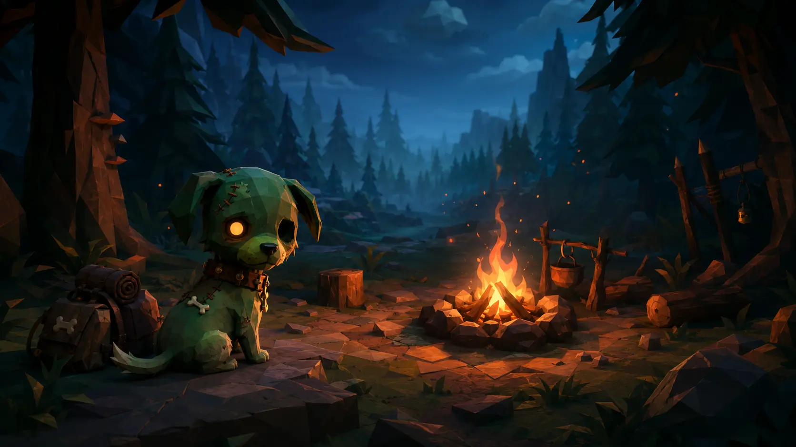

# Broono demo review

> **PR:** [#54 — Reset Broono as zombie-dog survival game](https://github.com/wilfgrainger/broono/pull/54)  
> **Status:** 3D visual overhaul · guest mode works · draft, not release-ready

**A good dog woke up undead. Survive the Wildwood for 99 nights.**

Broono is an original, mobile-first third-person survival game. Explore during daylight, gather supplies, keep the campfire fuelled and stay alive when the mirelings emerge after dark.

## New visual direction



This original production asset is now the real title-screen background. The playable renderer has also moved from flat top-down Phaser geometry to a Three.js/WebGL third-person scene.

| Before | Current branch |
| --- | --- |
| Flat overhead circles and triangles | Perspective 3D camera with smooth follow |
| Uniform green field | Sculpted terrain, clearing, paths, rocks, grass and layered conifers |
| Circular player token | Modeled zombie-dog Broono with ears, muzzle, collar, tag, ribs, glowing eye and gait |
| Orange camp circle | Stone-ringed campfire with crossed logs, animated flames, glow and shadow-casting light |
| Static colour change at night | Transitioning sky, fog, stars, sunlight, ambient light and fire dominance |
| Abstract resource symbols | Floating, lit 3D log piles and salvage caches |
| Basic black HUD cards | Survival HUD with portrait, health, hunger, time progress, hotbar and mobile controls |

The art direction is deliberately close to the reference game's readable low-poly survival atmosphere, while Broono, the Wildwood, mirelings, props, UI and map remain original.

## Three-minute reviewer script

1. Start the development server with `npm ci && npm run dev`.
2. Open the shown local URL and choose **Enter the forest**.
3. Move Broono with **WASD / arrow keys**, or drag the virtual stick on a phone-sized viewport.
4. Confirm the camera follows in third person and Broono turns, walks and wags in the direction of travel.
5. Walk over modeled log piles and salvage caches. Confirm the HUD totals change.
6. Return to the campfire with at least two wood and press **E / Use**. Confirm two wood are consumed and the flame/light visibly strengthens.
7. Let the 50-second daylight phase finish. Confirm the sky, fog, stars and lighting transition into night.
8. Confirm mirelings emerge from the forest, pursue Broono and apply contact damage.
9. Move outside the firelit clearing. Confirm exposure drains health.
10. Survive the 35-second night. Confirm daylight returns, threats clear and the night counter advances.

## What this slice proves

| Capability | Review evidence |
| --- | --- |
| Browser/mobile 3D | Three.js WebGL scene from the shared TypeScript client |
| Mobile budget | Instanced trees, rocks and grass; capped pixel ratio; compressed 68 KB WebP title asset |
| Mobile input | Touch joystick and large action button |
| Desktop input | WASD, arrow keys and E |
| Core loop | Explore → gather → refuel → survive → advance |
| Readable hero | Original modeled Broono is visible and animated in play |
| Atmosphere | Dynamic fog, sky, stars, shadows and firelight distinguish day from night |
| Progression | Bounded day/night cycle through night 99 |
| Threat pressure | Escalating mireling speed/spawn rate, exposure and collision damage |
| Offline entry | Guest play does not depend on the network |
| Account boundary | Google credential flow terminates at the Cloudflare Worker |
| Persistence foundation | D1 schema and authenticated save/leaderboard endpoints |
| Mobile packaging | Capacitor configuration for the shared web build |

## Validation recorded for this revision

```text
npm test
  2 tests passed

npm run build
  TypeScript, Worker type-check and Vite production build passed
  Client bundle: 141.85 KB gzip

npx wrangler deploy --dry-run
  Worker bundle and D1 binding validation passed
```

## Evidence policy

The old deterministic circle-and-triangle screenshots and animation were removed from this review because they no longer represent the product. A real browser/device recording remains blocked until the preview deployment is working; generated concept frames will not be presented as live gameplay.

The title artwork above is clearly identified as an authored title-screen asset. It is used by the application, not represented as an in-engine frame.

## Honest current limits

- Broono's current movement uses procedural body/leg motion rather than authored skeletal animation clips.
- Combat, crafting, rescues, seeded maps, game-over/restart, revive and cooperative parties are next-release work.
- The scene uses procedural low-poly meshes; authored biome packs, sound and particle systems remain future work.
- Google sign-in cannot complete until the OAuth client ID and Worker secrets are configured.
- Cloud saves and leaderboards require the real D1 database ID and initial migration.
- The Cloudflare preview deployment for this PR is currently failing, so there is no trustworthy public play URL or live browser/device recording yet.
- Client-reported leaderboard progress is provisional until server-authoritative run validation exists.

## Review questions

- Does Broono read immediately as the hero and as a zombie dog?
- Is the camera close enough for character but wide enough for gathering?
- Does the day-to-night lighting transition create enough tension?
- Are resources, the safe clearing and incoming mirelings readable on a phone?
- Should the next art pass prioritise authored Broono animation or a richer first rescue landmark?

## Next demo milestone

1. Restore a successful Cloudflare preview deployment.
2. Capture timestamped desktop, Android-sized and iPhone-sized frames from the exact PR head.
3. Record a real gather → refuel → night encounter.
4. Add game-over/restart and one complete crafting interaction.
5. Add authored sound and Broono animation clips.
