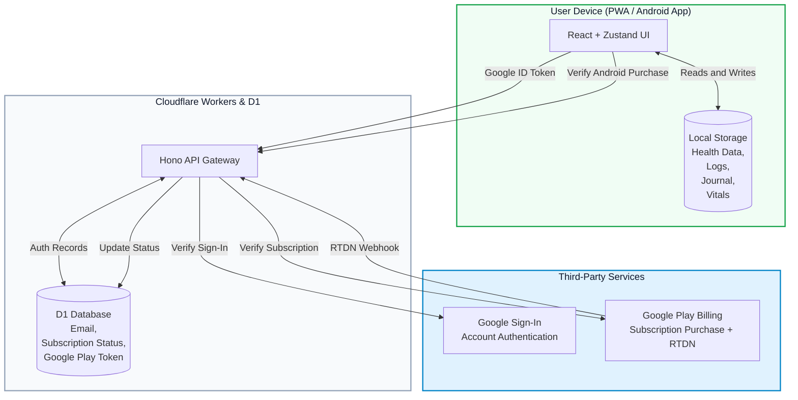

# Broono Data Architecture & Compliance

This document outlines how Broono handles user data for UK GDPR and Google Play Data Safety review.

## Architecture Diagram

## Compliance Breakdown

### UK GDPR

1. **Data minimization**
   Health logs, weight entries, injection schedules, water tracking, and journal entries remain on-device in local storage. Broono servers do not store that health data.

2. **Explicit consent**
   During login, users must agree to the Terms, Privacy Policy, and the local health-data processing disclosure before continuing.

3. **Data portability**
   Pro users can export their local profile, logs, and journal history from Settings for clinical or personal use.

4. **Right to erasure**
   The in-app Delete Account action removes the server-side account record and clears local persisted app data on success.

### Google Play Data Safety

- **Health and fitness data**
  Entered by the user and stored locally on-device. It is not transmitted to Broono servers.

- **Personal info**
  Email address is used for authentication. Subscription status and Google Play purchase references are used for billing verification.

- **Data deletion**
  Users can delete their account in-app. Local app data is cleared during successful account deletion and can also be removed by clearing app storage or uninstalling.

- **Encryption in transit**
  All traffic between the app and backend for authentication and subscription verification uses HTTPS/TLS.

### Billing Model

- Broono Pro is sold only through Google Play in the Android app.
- There is no web checkout path.
- Billing management and cancellation happen in Google Play subscriptions.
