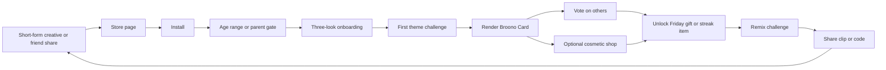
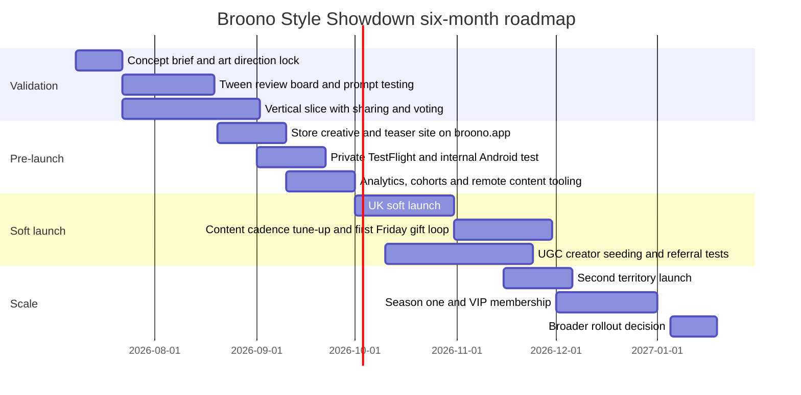

# broono.app mobile game opportunity report

## Executive summary

The strongest current evidence points to a simple conclusion: for girls aged roughly 10–13, the most commercially resilient mobile game concepts are not traditional “kids games” in the toddler sense, but **creative, identity-driven, safe social experiences** built around avatar customisation, pretend play, room design, story-making, and collectibles. In the live market right now, Toca Boca World leads both Similarweb’s US Android **Top Grossing Educational** ranking and its **Top Grossing Pretend Play** ranking, while Avatar World, Sago Mini World, Barbie Dreamhouse Adventures, Animal Jam, Bluey: Let’s Play!, and LEGO Bluey all sit visibly around the same family-friendly creative/simulation cluster. Google Play’s Kids tab for ages 9–12 also prominently features Toca Boca World and Bluey, reinforcing that creation-led play remains the clearest signal in the category. citeturn16view0turn13view1turn13view2turn8search0

The concept with the highest probability of viral breakout for **broono.app** is an **asynchronous fashion-and-theme challenge game** rather than a full open-world sandbox. The reason is structural: Google Play’s own editorial describes Roblox’s *Dress to Impress* as “taking the world by storm” and says it has passed **3 billion visits**, proving that timed themes, voting, rank climbing, and fashion self-expression produce exceptionally strong social conversation and repeat play. Separate research on children aged 8–13 shows avatar creation is driven by **self-representation, alter-ego experimentation, social needs, and performance motives**, which makes style-led identity play especially well matched to your target audience. citeturn14view4turn22view0

My recommendation is therefore **Broono Style Showdown**: a **safe, no-chat, asynchronous style-battle game** where players style an avatar and matching mini-scene to a prompt, publish a shareable “Broono Card”, vote on others, remix looks into new themes, and unlock weekly drops. It borrows the proven loop from fashion-voting games, but removes the moderation burden that comes with open UGC worlds. It is materially easier to build than a Toca-style sandbox, while still supporting strong short-form sharing, creator seeding, repeatable live ops, and cosmetic monetisation. citeturn14view4turn13view4turn20view0

The main strategic constraint is age compliance. Apple’s Kids category only covers **ages 11 and under**, while Google Play’s Kids surfaces go up to **ages 9–12**. Because your brief is **10–13**, the cleanest route is usually a **mixed-audience family-friendly app** with privacy-by-default, no open chat, no free-text bios, no profile photos, server-rendered sharing only, and a first-party analytics stack. That avoids the most restrictive distribution trade-offs while still complying with child-focused rules. Apple forbids third-party analytics and third-party ads in Kids Category apps; Google requires children’s ads to use Families self-certified SDKs and forbids interest-based advertising to children; COPPA and the UK Children’s Code both push strongly toward data minimisation and child-first defaults. citeturn8search3turn8search0turn4search0turn10search1turn4search2turn4search3

## Market signals and product constraints

Three market patterns matter most for broono.app. First, **open-ended creative worlds** are the category anchor: Toca Boca World says it serves more than **60 million girls and boys**, updates monthly, runs a recurring “Friday is gift day” reward ritual, and remains ad-free while monetising through in-app purchases. Second, **avatar-and-home customisation** is commercially proven at scale: Avatar World has **100M+ downloads** on Google Play and sits at No. 3 in Similarweb’s US Android pretend-play grossing ranking. Third, licensed or character-led simulations can still work, but often with heavier paywalls and broader monetisation stacks: Barbie Dreamhouse Adventures has **100M+ downloads**, contains ads and in-app purchases on Google Play, and remains a top pretend-play grosser. citeturn13view4turn14view1turn13view1turn13view3

The next crucial signal is that **self-expression and safe social visibility** are more important than pure progression mechanics for this age group. The 2025 study on children’s avatar-making in social online games found that children aged 8–13 create avatars for self-representation, alter-ego exploration, social needs, and in-game performance. That aligns almost perfectly with the current success of games such as Toca Boca World, Avatar World, and Dress to Impress. For broono.app, this means the best concepts should let players say, “this is me”, “this is my style”, or “this is my version”, then package that output into something easily shared or remixed. citeturn22view0turn14view4turn13view4turn14view1

There is also a strong cautionary signal around **manipulative monetisation**. A 2022 JAMA Network Open study found that the majority of children’s mobile apps in its sample used manipulative design features; only **20%** had none, and **95%** of children in the sample encountered at least one such feature in their most-used apps. The Oxford/ACM privacy-friendly apps study adds an uncomfortable but useful commercial insight: many child-app developers understand safer practices, but perceive them as financially risky. That means broono.app can stand out by making safety part of the product thesis rather than an afterthought: transparent cosmetic purchases, no fake urgency, no lootbox-style ambiguity, no chat-driven pressure, and no “energy wall” design that feels exploitative. citeturn23view2turn22view2

The monetisation environment is still attractive, but it rewards focus. Sensor Tower’s official 2025 mobile market summary says consumer spend across iOS and Google Play reached **$150 billion** in 2024, up **13% year on year**, while gaming returned to growth. Sensor Tower’s 2026 State of Mobile framing then describes the market as having shifted into a **“monetization-first era.”** For acquisition, Liftoff reports average **casual CPI** at **$1.41 on iOS** and **$0.14 on Android**, with kids games showing unusually strong IPM on iOS and high IPM on Android. For ad-led products, TopOn’s H1 2025 report shows Europe and North America producing the strongest casual-game ad eCPMs, with iOS rewarded video at **$12.24** and iOS interstitials at **$10.27** in that region. citeturn15search13turn15search0turn16view3turn17view0

The practical implication is that broono.app should **not** chase a broad, ad-heavy hypercasual model. The safer and more resilient path is a **hybrid creative game** with one or two monetisation levers done well: cosmetic packs, themed drops, optional VIP membership, and perhaps carefully restricted rewarded moments only in age-appropriate surfaces. GameAnalytics’ 2026 guidance is useful here: retention should be judged in the context of the business model, with **40/20/10** as a rough shorthand rather than a universal law, and post-launch teams should focus primarily on **retention and ARPDAU**. For a family-friendly style game, that means the real moat is not deeper economies; it is better first-session clarity, stronger content cadence, and more shareable output. citeturn20view0turn20view1

Because your audience sits across age thresholds, the release architecture matters. Apple says the Kids category is for apps designed specifically for children **11 and under**, organised into **5 and under, 6–8, and 9–11** bands, whereas Google Play’s Kids experiences include **9–12**. Apple’s Kids guidance and App Review Guidelines prohibit third-party analytics and third-party advertising in Kids Category apps. Google’s Families policies require age screening for mixed-audience apps, certified ad SDKs for children, and no interest-based advertising to child users. Apple’s Declared Age Range API and Google’s target-audience controls make it possible to tailor experiences by age band without collecting an exact date of birth from the child. citeturn8search3turn8search0turn4search0turn10search1turn8search5turn8search8

A concise product brief follows from all of this. Broono should aim for: **creative output over consumption, safe remix over open chat, cosmetics over pressure, weekly drops over giant scope, and mixed-audience privacy defaults over risky “social platform” ambition.** That is the combination most consistent with the market leaders, the compliance landscape, and a small-team build reality. citeturn13view4turn14view4turn23view2turn22view2

## Ten concept portfolio

The revenue ranges below are **directional year-one gross estimates** for an indie launch, not promises. They are anchored against current category ceilings and benchmarks rather than treated as forecasts: Toca Boca World still leads current Android educational and pretend-play grossing charts, Sensor Tower estimates roughly **$6 million** in recent monthly iOS revenue for Toca Boca World, Avatar World shows meaningful recurring revenue on both iOS and Google Play, and Bluey and Barbie also demonstrate scale. At the same time, casual UA economics remain sharply different on iOS and Android, and child-safety rules make ad-heavy monetisation less attractive for this brief. citeturn16view0turn13view1turn0search2turn24search0turn24search3turn24search4turn24search17turn16view3turn4search0turn10search1

**Broono Style Showdown** — Core gameplay: players receive a theme such as “midnight museum”, “roller disco”, or “forest popstar”, then style an avatar plus matching backdrop in 90 seconds before entering async voting rounds. Unique hook and viral mechanic: every entry becomes a polished **Broono Card** or six-second turntable clip with a “remix this look” deep link, creating natural UGC loops for Shorts, TikTok, Reels, and friend challenges. Target audience: highly aligned to girls 10–13, but broadened by fantasy, sport, cosplay, pets, and scene-design prompts rather than fashion-only prompts. Age-appropriate UX: large wardrobe tabs, very low reading load, no chat, no text comments, guided voting, parent gate for purchases, and “inspiration decks” instead of open searchable UGC. Development complexity: **medium**. Tech stack: Unity 6, Addressables, Spine or 2D skeletal animation, first-party Cloud Run/Firestore backend, rendered image/video export, and a whitelist asset system. Monetisation and modelled year-one revenue: cosmetic bundles, seasonal theme passes, VIP closet subscription, founder packs; **~£150k–£750k** if sharing loops take off. Retention: daily themes, weekly drops, streak cosmetics, monthly “star season”, remix chains, and creator-guided challenge packs. Competitor examples: Dress to Impress, Avatar World, Toca Boca World. Go-to-market: short-form creator seeding, “beat my look” UGC chains, Apple custom product pages, Google Play store listing experiments, Pinterest mood-board posts, and parent-managed tween creator partnerships. citeturn14view4turn22view0turn14view1turn13view4

**Dream Room Remix** — Core gameplay: players design tiny rooms, lockers, vans, dorm corners, clubs, or treehouses using drag-and-drop décor pieces under prompt-based constraints. Unique hook and viral mechanic: players can publish a **before/after room flip** or accept “remix my room” challenges where another player must improve a space with limited pieces. Target audience: strong for 10–13, especially children drawn to décor, organisation, and lifestyle play; still broadly appealing because the fantasy is “my space” rather than “girl space”. Age-appropriate UX: snap grids, undo everywhere, no text input, simple colour sets, audio instructions, accessibility-friendly contrast. Development complexity: **medium**. Tech stack: Unity 2D, addressable décor packs, deterministic room state serialisation, safe gallery cards. Monetisation and modelled year-one revenue: room themes, décor bundles, seasonal location packs, VIP storage; **~£100k–£500k**. Retention: daily room briefs, weekend makeover tournaments, limited curated décor drops, collection books. Competitor examples: Toca Boca World, Barbie Dreamhouse Adventures, Kalliu Game World. Go-to-market: Pinterest-style static creatives, before/after Shorts, interior-aesthetic UGC, family/lifestyle creator placements. citeturn13view4turn13view3turn16view1

**Pocket Story Studio** — Core gameplay: players assemble short comic-strip or sticker-story scenes from characters, emotes, props, backgrounds, and sound cues, then publish them as swipeable panels or tiny animated scenes. Unique hook and viral mechanic: a safe **story remix chain** where one person starts scene one, another continues scene two, and the app auto-stitches the final micro-story. Target audience: creative tweens, readers, doodlers, fandom-minded children, and children who like roleplay but not live multiplayer. Age-appropriate UX: starter templates, story prompts, icon-led tools, optional voiceover only if parent-enabled, and no free text required. Development complexity: **medium**. Tech stack: Unity or Flutter + Flame for lighter scope, timeline animation, template-driven scene renderer, cloud save, safe export. Monetisation and modelled year-one revenue: sticker packs, narrative theme packs, story FX packs, export subscription; **~£80k–£400k**. Retention: daily prompts, curated “story of the week”, collaborative chain stories, character set seasons. Competitor examples: Toca Boca World, Crayola Create and Play, Disney-style creation apps. Go-to-market: comic-style UGC, story templates for creators, school-holiday prompt events, search ASO around “story game”, “comic maker”, and “avatar story”. citeturn13view4turn16view1turn12search2

**Moonlight Mystery Club** — Core gameplay: players solve cosy episodic mysteries by building clue boards, interviewing characters in branching dialogue, and styling tools or disguises for missions. Unique hook and viral mechanic: “choose your suspect” share cards and weekly community deduction votes before the next episode lands. Target audience: slightly older end of your brief, especially 11–13, but still broadly appealing because the tone is puzzle-first and non-scary. Age-appropriate UX: chapter maps, hint-on-demand, no dark horror aesthetics, clear language support, no stressful fail states. Development complexity: **medium-high**. Tech stack: Unity narrative framework, lightweight branching content CMS, first-party telemetry, episodic asset pipeline. Monetisation and modelled year-one revenue: chapter bundles, clue cosmetics, season pass, premium detective kit; **~£70k–£300k**. Retention: weekly episode cadence, suspicion polls, collectible clue books, limited-time side mysteries. Competitor examples: Animal Jam for world feel, Bluey/LEGO Bluey for family-safe episodic content, broader cosy mobile mystery titles for structure. Go-to-market: mystery Shorts, “who did it?” polls, bookish and tween creator channels, App Store push around school holidays. citeturn16view0turn16view1turn21search8

**Pet Parade Rescue** — Core gameplay: rescue, groom, train, and style adoptable fantasy pets, then build themed habitats and send them on parade missions or friendship quests. Unique hook and viral mechanic: each pet has a **personality card** and parade-ready look; players share “before rescue / after sparkle” transformations and limited parade challenge entries. Target audience: among the broadest options in the list because pets cut across gender lines while still resonating strongly with girls 10–13. Age-appropriate UX: transparent collection mechanics, no random loot boxes, simple care loops, gentle reminders rather than pressure timers. Development complexity: **medium-high**. Tech stack: Unity 2D/2.5D, pet-state system, collection album, habitat decorator, safe gallery sharing. Monetisation and modelled year-one revenue: transparent pet bundles, habitat packs, style accessories, optional membership; **~£120k–£600k**. Retention: rotating parades, pet birthdays, habitat seasons, collection milestones, rescue stories. Competitor examples: Fluvsies, Sago Mini World, Avatar World’s companion-style play, and Roblox pet-collection trends. Go-to-market: pet transformation clips, “adopt my parade theme” challenges, creator packs, family-friendly influencer partnerships. citeturn13view1turn13view2turn14view1turn14view3

**Spell and Sprinkle Bakery** — Core gameplay: a magical bakery sim where players mix recipes through rhythm and timing mini-games, decorate desserts, and furnish a whimsical café. Unique hook and viral mechanic: players export dessert cards and limited-time bakery menus, then challenge others to recreate or improve them under prompt constraints. Target audience: ideal for the cosy-sim audience; still inclusive because the fantasy is craftsmanship and management rather than narrowly gendered roleplay. Age-appropriate UX: visual recipes, optional text labels, short sessions, no harsh fail loops, easy one-hand play. Development complexity: **low-medium**. Tech stack: Unity 2D, recipe-state system, event-driven kitchen minigames, simple café decorator. Monetisation and modelled year-one revenue: recipe books, décor packs, seasonal ingredient passes, premium bakery skins; **~£60k–£250k**. Retention: daily specials, weekend bake-offs, holiday menus, loyal-customer rewards. Competitor examples: Strawberry Shortcake Bake Shop, Barbie Dreamhouse’s cooking and lifestyle activities, Budge’s broader cosy catalogue. Go-to-market: satisfying food clips, “decorate this cupcake” creator challenges, seasonal food ASO, Pinterest boards. citeturn13view1turn13view3turn21search7

**Anti-Gravity Playground** — Core gameplay: players build tiny floating parks, obstacle toys, and gravity-bending contraptions, then test them in short physics challenges. Unique hook and viral mechanic: a puzzle or creation can be published as a **challenge code card** that invites another player to beat the setup or remix the build with one extra rule. Target audience: very broad and less obviously feminine, which actually helps the “broad appeal” side of your brief while still feeling stylish if the art direction is soft and colourful. Age-appropriate UX: drag-and-drop parts, tutorial ghosts, instant reset, no precision punishment, and a strong sandbox mode. Development complexity: **low-medium**. Tech stack: Unity 2D physics, server-side challenge seed storage, deterministic replay snippets. Monetisation and modelled year-one revenue: part packs, environment sets, creator toolkit upgrades; **~£50k–£220k**. Retention: weekly featured builds, challenge ladders, holiday parts, invention journals. Competitor examples: Toca Boca Builders and lighter creation sandboxes rather than direct pretend-play sims. Go-to-market: highly shareable physics fails and wins, Shorts-first creative, creator challenge ladders, STEM-parent crossover reach. citeturn2search13turn12search2

**Sticker Pop Quest** — Core gameplay: a sticker-collection and scene-crafting game where players unlock themed stickers through light puzzle play, then use them to decorate journals, postcards, and mini-scenes. Unique hook and viral mechanic: players publish themed sticker boards and compete in “best page” or “best postcard” weekly exhibitions. Target audience: especially good for children who love stationery, journalling, K-pop/fandom visual culture, and low-stress creativity. Age-appropriate UX: tactile drag interactions, collage templates, no text needed, clear save/share behaviour. Development complexity: **low**. Tech stack: Flutter + Flame or Unity 2D, sticker pack CMS, simple export renderer. Monetisation and modelled year-one revenue: sticker bundles, monthly journalling club, seasonal stationery packs; **~£70k–£320k**. Retention: weekly sticker drops, postcard exchange events, collection albums, journal streaks. Competitor examples: Crayola Create and Play, Disney Coloring World, and creation-led educational apps. Go-to-market: stationery TikTok, journalling creators, printable tie-ins on broono.app, UGC postcard chains. citeturn16view1turn16view0

**Secret Garden Merge** — Core gameplay: players restore a magical garden by merging plants, décor, and creatures, then unlocking stories and themed zones. Unique hook and viral mechanic: merged creations become a **garden snapshot** players can show off, while featured garden “recipes” encourage others to build the same visual set. Target audience: broad casual appeal with especially strong fit for cosy and collection-driven players. Age-appropriate UX: avoid hard energy gating, keep sessions short, large visual affordances, and explicit progression goals. Development complexity: **medium-high**. Tech stack: Unity 2D/2.5D, merge economy, zone-unlock narrative system, snapshot export. Monetisation and modelled year-one revenue: décor packs, garden passes, convenience bundles, creature styles; **~£120k–£650k**. Retention: new seasonal zones, merge chains, collectible creature books, event gardens. Competitor examples: current casual chart leaders such as Travel Town for merge structure, blended with family-safe art direction. Go-to-market: satisfying merge creative, garden reveal clips, event-based ASO, creator challenge seeds. citeturn0search4turn20view0

**Squad Quest Postcards** — Core gameplay: players complete light daily “friendship quests” such as styling for a concert, packing a digital travel bag, or making a luck charm, then send safe rendered postcards to their invited squad. Unique hook and viral mechanic: the app turns play into **collectible social postcards**; every campaign spawns a new chain and encourages return visits without live chat. Target audience: this is the most explicitly friendship-led concept, strongest for girls 10–13 but still inclusive if the aesthetics are adventure and activity based rather than romance based. Age-appropriate UX: no messaging, no comments, invite-only codes, pre-written reactions, strong guardian controls. Development complexity: **medium**. Tech stack: Unity 2D, invite-code system, postcard pipeline, first-party notification orchestration. Monetisation and modelled year-one revenue: postcard themes, squad bundles, club membership, limited event albums; **~£60k–£280k**. Retention: squad streaks, seasonal postcard books, weekend missions, safe invite loops. Competitor examples: child-safe social-light systems more than direct one-to-one game clones; the closest proof points come from avatar creation and community challenge mechanics rather than real-time chat products. Go-to-market: friend-challenge content, parent-friendly positioning, school-holiday campaigns, referral-led ASO. citeturn22view0turn4search3turn10search1

## Concept comparison

The scoring below is a strategic assessment synthesising current charts, proven mechanics, monetisation fit, compliance friction, and realistic indie build scope. Higher virality and monetisation scores are better; lower complexity and shorter time-to-market are better.

| Concept | Virality potential | Monetisation potential | Dev complexity | Time to market | Strategic read |
|---|---:|---:|---|---|---|
| Broono Style Showdown | 5/5 | 4/5 | Medium | 4–6 months | Best mix of proven UGC loop, safe social design, and manageable scope |
| Dream Room Remix | 4/5 | 4/5 | Medium | 5–7 months | Strong décor/share loop, slightly less naturally viral than head-to-head style play |
| Pocket Story Studio | 4/5 | 3/5 | Medium | 4–6 months | Superb creativity angle, but monetisation depends on packs rather than competitive urgency |
| Moonlight Mystery Club | 3/5 | 3/5 | Medium-high | 6–8 months | High differentiation, lower shareability than style or décor |
| Pet Parade Rescue | 4/5 | 4/5 | Medium-high | 6–9 months | Broad audience and strong collection potential, but systems scope is larger |
| Spell and Sprinkle Bakery | 3/5 | 3/5 | Low-medium | 3–5 months | Fast to prototype and easy to market visually |
| Anti-Gravity Playground | 3/5 | 2/5 | Low-medium | 3–5 months | Broadest appeal, but weakest premium monetisation without strong creator tooling |
| Sticker Pop Quest | 3/5 | 3/5 | Low | 3–4 months | Cheapest to ship, especially good as a test product or companion app |
| Secret Garden Merge | 4/5 | 5/5 | Medium-high | 6–8 months | Strongest pure monetisation logic, but easiest to drift into manipulative design |
| Squad Quest Postcards | 4/5 | 2/5 | Medium | 4–6 months | Nice safe-social angle, but monetisation is softer than style/decor games |

| Shortlist | Why it belongs near the top | Why it still loses to the recommendation |
|---|---|---|
| Broono Style Showdown | Proven fashion-vote-remix loop, huge UGC potential, strong cosmetic spend logic | It does not lose; this is the recommendation |
| Dream Room Remix | Excellent “before/after” sharing and décor monetisation | Slightly less inherently competitive, so weaker creator loop |
| Pet Parade Rescue | Very broad demographic reach and strong collecting fantasy | Bigger content burden, more systems complexity, higher balance risk |
| Secret Garden Merge | Best direct monetisation ceiling | Higher ethical risk and less distinctive brand identity |

The comparison confirms a useful strategic split. If your immediate priority is **viral probability**, Style Showdown is first. If your priority is **premium-feeling creativity**, Dream Room Remix is second. If your priority is **raw monetisation ceiling**, Secret Garden Merge is strongest but also the most likely to tempt you into pressure-heavy economy design that does not fit the brand or regulatory context. citeturn14view4turn23view2turn4search0turn10search1

## Recommended concept

The recommended product is **Broono Style Showdown**.

The business case is unusually strong for a small team. Google Play’s editorial says *Dress to Impress* has passed **3 billion visits** and retained **hundreds of thousands of players**, which is rare evidence of a specific mechanic — timed styling plus voting plus rank progression — achieving cultural velocity. Unlike a full sandbox world, that loop does not require hundreds of props, locations, quests, or AI moderation layers to feel alive. Unlike a pure merge game, it is naturally expressive and community-facing on day one. And unlike a Roblox-style live social world, it can be made safe with async sharing, no text chat, and asset-whitelisted output only. citeturn14view4turn14view3turn4search3turn10search1

It also fits the underlying developmental psychology better than most alternatives. Research on children aged 8–13 shows that avatar-making is tied to self-representation, alter-ego experimentation, social needs, and performance. A style game lets broono tap all four drivers at once: “this is me”, “this is my fantasy version”, “this is what I want friends to see”, and “this scored well”. That is exactly the kind of loop that produces repeat sessions, shareable outcomes, and intentional collecting without needing risky social features. citeturn22view0

The best version of this concept is **not** a generic dress-up app. It should be framed as a **theme-challenge creation game** where the player styles one avatar and one micro-scene together. That broadens the fantasy from “clothes” to “creative direction”. A prompt might ask for “space camp DJ”, “stormy castle goalkeeper”, “rainbow pet detective”, or “retro arcade botanist”. That makes the theme language less stereotypically feminine, keeps boys and girls included, and opens the door to props, pets, set design, and storytelling. The competitive unit is then the whole look, not just the outfit. That design choice is directly in line with the broad, gender-neutral appeal that Toca Boca positions as a strength. citeturn2search9turn13view4

The live-ops model is also already validated. Toca Boca World explicitly markets **monthly content updates** and a recurring **Friday gift** ritual; those mechanics matter because they create a habit and a low-friction reason to reopen. Broono Style Showdown should copy the cadence principle, not the sandbox scale: **daily themes, Friday freebies, monthly “star seasons”, and occasional collab-style trend packs** built around broad moods rather than expensive licences at first. citeturn13view4

A safe monetisation structure is straightforward. The free game includes a generous base wardrobe, weekly gifts, and rotating prompts. Paid layers are transparent: themed outfit packs, scene prop packs, animation/pose packs, and a low-price optional VIP membership that grants expanded saved looks, premium studio backdrops, and early access to Friday drops. Do **not** use randomised item drops, hard energy gates, pressure timers, or ad walls. That is both a product-quality call and a child-safety positioning advantage. citeturn23view2turn4search0turn10search1

The app-store creative should sell **action, theme, and output** rather than a vague world. The right rule is: every asset should answer one of three questions in under two seconds — *what do I do, what do I make, why would I show it to someone else?*

| Asset | Suggested creative direction |
|---|---|
| App icon | Bold avatar headshot with a crown/trophy accent and a strong colour split; readable at small size |
| iOS screenshot opening set | “Style a theme in 90 seconds” → “Vote and climb” → “Remix friends’ looks” |
| Google Play feature graphic | Three avatars on a runway with one large prompt card in the centre, e.g. “MIDNIGHT MUSEUM” |
| Preview video hook | Start with the countdown, reveal the prompt, then jump straight to three finished looks and a remix challenge |
| Seasonal custom product pages | Back-to-school, spooky season, winter lights, festival week, summer party |
| Website hero on broono.app | Player-made cards in a moving masonry wall with “Can you beat this look?” |

The social and UGC layer should remain **fully safe by construction**. The most effective mechanics are the ones that do not require text moderation at all.

| Social mechanic | How it works | Why it matters |
|---|---|---|
| Broono Cards | Share a finished look as a static image with the theme and score | Cleanest low-risk sharing unit |
| Turntable clip | Six-second auto-rendered video of the avatar + scene | Ideal for Shorts/Reels/TikTok |
| Remix link | Opens the same theme with one new constraint | Creates chain behaviour and re-entry |
| Pre-set reactions | “So clever”, “Love the colours”, “Wild choice”, all pre-written | Social feedback without comments |
| Squad challenge codes | Invite-only challenge rooms using short codes | Friend loops without public chat |
| Featured trend packs | Weekly curated prompts inspired by safe trends | Gives creators a reason to post repeatedly |

## Launch plan and roadmap

The launch plan should deliberately separate **validation**, **content discipline**, and **scale**. In month one, you are not trying to launch a full live game; you are trying to answer four questions: do children understand the loop immediately, do they care about the prompt themes, do they share the output, and do they come back for a second challenge? GameAnalytics’ 2026 guidance is the right frame here: early retention is about proving the core experience, and once live the two anchor KPIs are **retention** and **ARPDAU**. citeturn20view0turn20view1

The first month should therefore revolve around a constrained vertical slice: one avatar body type, three base body shapes, six skin tones, twenty hairstyles, forty clothing items, ten prompt themes, five backgrounds, one voting flow, one share-card renderer, and one cosmetics shop stub. Use your daughters as a weekly **tween review board**: every Friday, run a short steering.md review covering prompt clarity, “would I share this?”, favourite categories, boredom points, and any wording that feels too childish or too mature. Use Google AI tools or Playground only for ideation support — theme brainstorming, survey synthesis, rough script generation, or creative variant drafting — and keep all final content human-curated. That preserves quality and safety while still speeding iteration.

For market testing, I would soft launch in **English-speaking markets with similar purchasing behaviour and store cultures** before a broad rollout. A practical sequence is UK first for convenience, then Canada or Australia if store metrics justify it. Paid UA should be limited early; the most efficient first traffic source for this concept is likely creator-led short-form content because the product itself produces showable output. Liftoff’s benchmarks show casual acquisition remains much more expensive on iOS than Android, which is another reason to delay large paid spend until store conversion and retention are already healthy. citeturn16view3

The six-month roadmap below assumes a start immediately after this report.

The KPI framework should be intentionally narrow. The product team should live on one dashboard for the first six months.

| KPI | Month-one target | Month-six target | Why it matters |
|---|---:|---:|---|
| Tutorial completion | 80%+ | 90%+ | Signals onboarding clarity |
| First challenge completion | 65%+ | 80%+ | Confirms core loop comprehension |
| Share-card creation rate | 10%+ of completers | 20%+ | Leading indicator of virality |
| D1 retention | 30%+ | 35–40% | Validates FTUE and prompt appeal |
| D7 retention | 8%+ | 12–15% | Indicates repeatable habit loop |
| D30 retention | 3%+ | 5–8% | Shows real content depth |
| Vote participation rate | 40%+ of DAU | 55%+ | Critical for async social density |
| IAP conversion | 1.0%+ | 2.0–3.0% | Early cosmetic monetisation health |
| ARPDAU | £0.015+ | £0.04–£0.08 | Operating monetisation quality |
| Friday gift open rate | 25%+ | 40%+ | Measures content cadence pull |

These targets are chosen to be demanding but coherent with the product model. If you ever get close to GameAnalytics’ shorthand **40/20/10** shape on this concept, you are in breakout territory; if you cannot get D1 and first-challenge completion healthy, you should not scale content or spend. citeturn20view0turn20view1

The best A/B tests are the ones that attack the first-session puzzle and the share loop directly.

| Test | Variant A | Variant B | Success metric |
|---|---|---|---|
| Onboarding style | Three-step guided styling | Single fast interactive demo | Tutorial completion, D1 |
| Prompt difficulty | Concrete themes | Abstract themes | First challenge completion, share rate |
| Vote framing | “Pick the winner” | “Pick the most creative” | Vote participation, session length |
| Reward timing | Reward after first entry | Reward after first vote | D1, loop completion |
| Asset density | Smaller starter wardrobe | Larger starter wardrobe | FTUE satisfaction, IAP conversion |
| Share output | Static Broono Card | Six-second turntable clip | Share rate, reinstall referrals |
| Shop placement | Post-voting | Post-reward | IAP conversion, churn impact |
| Friday gift format | Single item | Three-item choice | Weekly return, session count |
| Theme cadence | Daily global theme | Daily plus one local/seasonal theme | D7 retention, creator uptake |
| Social entry | Public trending gallery | Invite-code squad room first | Safety, share rate, D7 |

The biggest risk is not technical. It is **positioning drift**. If Broono becomes “too little-kid”, 12–13 year-olds will abandon it. If it becomes “too social platform”, you inherit moderation and safety expectations that a small team should avoid. The winning middle is a product that feels **stylish, expressive, challenge-based, and obviously safe**. That is why Broono Style Showdown is the best first bet: it gives you the viral surface area of a social trend without the operational burden of becoming a social network. citeturn14view4turn4search3turn10search1